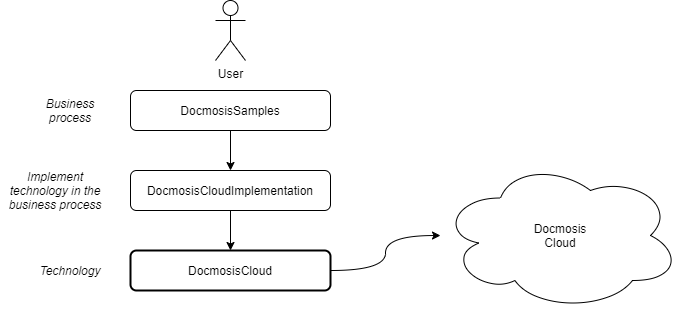

# Example app

<h2>Table of contents</h2>

- [Introduction](#introduction)
- [Where to find the app](#where-to-find-the-app)
- [What is in the app](#what-is-in-the-app)

## Introduction

The example app is used to test the integration Docmosis module. Therefor it can be used by you to see how you can implement the module in your own app.

## Where to find the app

Download the [latest version as zip file](https://github.com/Docmosis/mendix-tools/archive/main.zip) or use git to clone it from the [GitHub repository](https://github.com/Docmosis/mendix-tools).

If you want to run the app then open it in Mendix Studio Pro and in the profile update the two DocmosisCloud module constants with your access key and end point.

## What is in the app

These modules are in the app:

- **DocmosisCloud:** That is [the module](module.md) where this is all about.
- **DocmosisSamples:** The business entities to manage customers, products and invoices and trigger the creation of PDFs.
- **DocmosisCloudImplementation:** This module implements the module in this specific app with its specific needs. Here decision are made how to create PDFs, how to handle errors, etc. This is specific to the app, operational needs, etc,
- **DocmosisCloudUnitTesting:** Implementation of unit tests for the [DocmosisCloud module](module.md), directly related to development of it.

This is what the app looks like in terms of layers. DocmosisCloudUnitTesting is out of scope.

