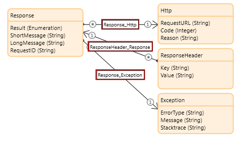

# The module

<h2>Table of contents</h2>

- [Requirements](#requirements)
- [Terminology and process](#terminology-and-process)
- [Create a template](#create-a-template)
- [Generate the data structure in your app](#generate-the-data-structure-in-your-app)
- [Render the document](#render-the-document)
- [Common request initialization parameters](#common-request-initialization-parameters)
- [Generic request object attributes](#generic-request-object-attributes)
- [Generic response object attributes](#generic-response-object-attributes)

## Requirements

The module can be imported in an app on [Mendix Studio Pro 8.12.5 or later](https://marketplace.mendix.com/link/studiopro/). That makes it compatible with Mendix 9 and in [version 8.12.5](https://docs.mendix.com/releasenotes/studio-pro/8.12#8125) a major security fix was implemented.

And it depends on Marketplace module [CommunityCommons](https://appstore.home.mendix.com/link/app/170/Mendix/Community-Commons-Function-Library).

## Terminology and process

The module is a wrapper around the Docmosis web services. This are the actions in your microflow:

1. **Prepare the request:** This results in an pre-populated object where you can make additional adjustments. See the [Docmosis Cloud DWS3 Web Services Guide](https://resources.docmosis.com/content/documentation/cloud-dws3-web-services-guide) for details and examples.
2. **Execute the request:** The data is transformed to a proper web service request and send to Docmosis. The response is interpreted and in case of an error details of the error are stored in the response.
3. **Interpret the response:** In case of a successful execution the response contains the requested data. See the [Docmosis Cloud DWS3 Web Services Guide](https://resources.docmosis.com/content/documentation/cloud-dws3-web-services-guide) for details and examples. In case of an error you will find error details, see [paragraph Generic response object attributes](#generic-response-object-attributes).

## Create a template

Before you can actually render documents you have to create a template. See the [Docmosis resources website](https://resources.docmosis.com) and in particular the [DWS3 Template Guide](https://resources.docmosis.com/content/documentation/cloud-dws3-template-guide) how to create a template.

Use Docmosis Cloud Console to upload the template.

## Generate the data structure in your app

In your app you have to collect all required data and structure that in such a way that it is compatible with the template you created. The module offers a function that supports you in generating a non-persistent data structure.

In case you want to create the structure manually then you can skip the remainder of this paragraph. Otherwise continue reading and the [example app](example-app.md) shows how you can use it yourself.

First initialize the request using microflow `GetSampleDataRequest_Initialize`:

- **TemplateName**: path and name of the template to use, for example *samples/InvoiceTemplate.docx*
- common parameters are [documented here](#common-request-initialization-parameters)

It returns an object of type `GetSampleDataRequest`. By default the data structure with sample data is returned as JSON, but if you prefer XML then change attribute `GetSampleDataRequest.Format` after initialization of the request object.

Next call microflow `CWS_GetSampleData` to lookup the structure and return it. A `GetSampleDataResponse` object is returned which contains the requested structure information in attribute `GetSampleDataResponse.TemplateSampleData`.

Now you have a JSON or XML string that you can use in your app model to 1) create a [JSON Structure](https://docs.mendix.com/refguide/json-structures) or [XML Schema](https://docs.mendix.com/refguide/xml-schemas) document, 2) create an [export mapping](https://docs.mendix.com/refguide/export-mappings) and 3) [generate entities and associations](https://docs.mendix.com/refguide/map-automatically) that match the export mapping. Eventually tweak and tune the entities and associations, for example the naming of the entities.

All you have to do is copy/transform your app's data to this new data structure and use that in the [render process](#render-the-document).

## Render the document

Assuming you have a template and data then you can render the document.

First initialize the request using microflow `RenderRequest_Initialize`:

- **TemplateName**: path and name of the template to use, for example *samples/InvoiceTemplate.docx*
- **OutputName**: name of the rendered document where the file extension tells Docmosis what type of document to generate, for example *invoice-21I000388.pdf*
- common parameters are [documented here](#common-request-initialization-parameters)

It returns an object of type `RenderRequest` and when needed the attribute values can be adjusted. In [Docmosis Cloud DWS3 Web Services Guide chapter 2.4](https://resources.docmosis.com/content/documentation/cloud-dws3-web-services-guide) you will find a detailed explanation of all attributes.

It is extremely flexible and powerful, so to help you get started quickly here are some common use cases:

- (Default behavior) Render the document and return it to your app
  - `StoreTo=stream` - return the rendered document to the app
- Render to PDF-A and return it zipped to your app
  - `OutputFormat=pdf` - explicitly tells the render engine to create a PDF, regardless the file extension used in `OutputName`
  - `StoreTo=stream` - return the rendered document to the app
  - `CompressSingleFormat=true` - zip the document
  - `PdfArchiveMode=true` - render the PDF as type PDF-A
- Render the document and tag it so you can report on it
  - `Tags=invoice;services` - increment tags *invoice* and *services* so on a monthly basis you can report on the amount of pages and documents generated
- Render to DOCX and mail it to *sales@mycompany.tld* for follow up
  - `OutputFormat=docx` - explicitly tells the render engine to create a DOCX, regardless the file extension used in `OutputName`
  - `StoreTo=mailto:sales@mycompany.tld` - mail the rendered document to *sales@mycompany.tld*
  - `MailSubject=Draft invoice 123` - the email's subject
  - `MailBodyText=Hereby the draft of invoice 123` - the email's plain text body

> Note:
> Attribute `StreamResultInResponse` is enforced to `true` for module implementation reasons. Changing it yourself will not change the behavior.
> Attribute `Data` will be populated with your data. Any data you put in here will be overwritten. See the next paragraph for details.

The next step is equally or maybe even more important: the data to be merged with the template. Your app has to generate a JSON string that matches the template. So typically that is a flow that involves data retrieval, creating one or more non-persistent objects and export it to JSON; see also paragraph [Generate the data structure in your app](#generate-the-data-structure-in-your-app). As that is completely specific to your app exact details cannot be given here. The [example app](DOCS/example-app.md) can be used as inspiration if you are new to this.

When the `RenderRequest` object is set as required and a string with JSON data is available then call microflow `CWS_Render` to render the document.

The `RenderResponse` object returned contains the rendered document in [Base64](https://en.wikipedia.org/wiki/Base64) format in attribute `RenderResponse.Base64File`. You can use microflow `FileDocument_Base64Decode` to decode it to a [specialized `System.FileDocument`](https://docs.mendix.com/howto/data-models/working-with-images-and-files#4-file-documents) object, or process it otherwise that fits your need. And see also [Generic response object attributes](#generic-response-object-attributes) for an explanation of the other attributes and what to do in case of an error.

> The document is returned as [Base64](https://en.wikipedia.org/wiki/Base64), which is different from default Docmosis behavior. This is an explicit characteristic of the module to be able to return a consistent type of response.

## Common request initialization parameters

Most, if not all, request initialization microflows have these parameters in common:

- `APIAccessKey`: your Docmosis access key, see Docmosis Cloud Console for the access key
  - When empty then the value of constant `@DocmosisCloud.APIAccessKey` is used
- `APIEndPoint`: the Docmosis Cloud API endpoint, see Docmosis Cloud Console for the available endpoints
  - When empty then the value of constant `@DocmosisCloud.APIEndpoint` is used

Why would you specify another access key or endpoint than stored in the constants? Here are two use cases that cannot be implemented if the module relied on the constants:

1. your multi-tenant app allow tenants to specify their own keys and end points to be used
2. the access key is stored in a centralized configuration vault, for example [HashiCorp Vault](https://www.vaultproject.io), and the key is retrieved on runtime and not set on deployment

## Generic request object attributes

Every request has these attributes as a minimum:

- `APIAccessKey`: your Docmosis access key, see Docmosis Cloud Console for the access key
- `APIEndPoint`: the Docmosis Cloud API endpoint, see Docmosis Cloud Console for the available endpoints
- `RequestID`: a UUID uniquely identifying a request, but you can replace this with your own value
  - In most cases this value is not used by Docmosis but can be used by your app, for example in logging
  - When rendering a document this value can be used, for example when the document is sent by email then RequestID is added to the email's subject. See the [Docmosis Cloud DWS3 Web Services Guide](https://resources.docmosis.com/content/documentation/cloud-dws3-web-services-guide) for details.

## Generic response object attributes

Every response has these attributes:

- `Result`: an enumeration specifying the overall result
  - `Success`: the happy flow
  - `Error`: the web service request succeeded, but there was an issue with the template, data or otherwise
  - `Exception`: the web service request failed
- `ShortMessage` and `LongMessage`
  - these attributes are set by Docmosis and contain feedback, so likely then the request was not successful
- `RequestID`: copied from the request object, see [Generic request object attributes](#generic-request-object-attributes)
- `Http`: Http response details like the request URL used and technical details returned by the Docmosis Cloud; this is helpful in troubleshooting errors
- `Exception`: in case `Result=Exception` here you will find Mendix exception details, copied from `$latestError` so similar to the `System.Error` entity
